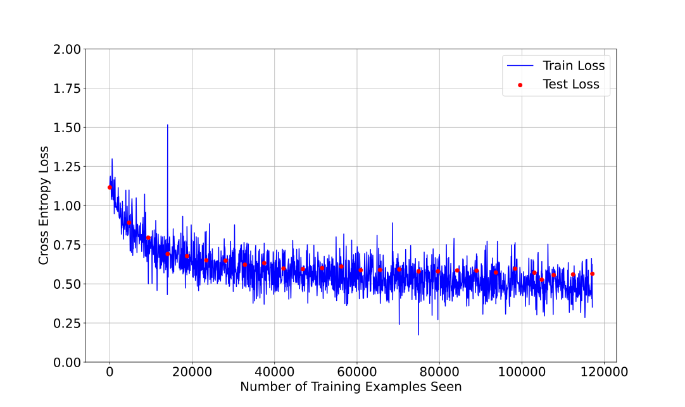
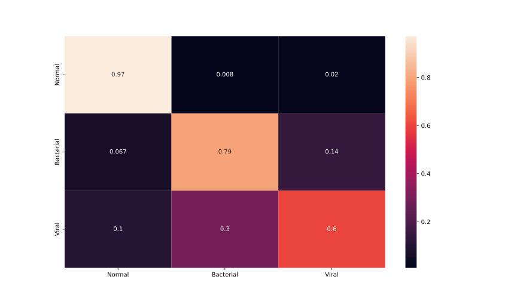

Pneumonia Detection and Differentiation from X-Ray Images
======
_project documentation by Friedrich Balassa, Rune Fritzsche and Lorenz Maurer_

# Introduction
Pneumonia is an inflammatory condition of the lung.
It can be caused by bacteria or viruses and can lead to dry cough, chest pain, fever, and difficulty breathing [^0]. 
The effects of pneumonia can reliably be recognized on chest x-ray images by trained medical professionals. 
This opens up the possibility of automating the classification by utilizing image recognition techniques, including classification with neural networks. 
The goal of an automated recognition would be to use an x-ray image as an input and receive a classification into either a "healthy" class or, if pneumonia is detected, either a "bacterial" or a "viral" class to distinguish between causes which may affect which treatment is recommended. 
In order to be effective, the overall accuracy of the prediction needs to be reasonably high; furthermore, certain error metrics may be deemed more or less important (e.g. false positive or false negative rates referring either to all categories or only regarding "healthy" and "pneumonia" labels). 
Creation of such a model for classification involves choosing an appropriate model architecture, collecting a sufficiently large training dataset with labelled x-ray images for "ground truth", and training the model to optimize its parameters. 

# Dataset
The dataset this work is based on is a publicly available dataset of labelled chest x-ray images [^1]. 
The dataset contains 5856 images divided into folders for training, validation and test sets. 
The label of the image ("healthy", "bacteria" or "virus") is contained in the file name. 
Originally, the split of images was as follows: 

|  | Healthy | Bacterial | Viral |
| ---|---|---|---|
| Training | 1341 | 2530 | 1345 |
| Validation | 8 | 8 | 0 |
| Test | 234 | 242 | 148 |
| Total | 1583 | 2780 | 1493 |

Simply adopting this structure would however have provided less flexibility with regards to choosing fractions of training and test sets to use. 
Furthermore, the validation set crucially contains no images of viral pneumonia which would lead to concerns of lower accuracy in recognizing this category. 
It was therefore decided to merge all images and do the training/test split in code which allows adjusting the percentages for each set on-the-fly. 
At the same time, they were renamed and their file name and label saved in a .csv file to make them accessible for our code. 

Inspecting individual images also revealed some heterogeneity in the metadata: since images presumably come from a range of sources rather than one medical facility alone, the images have different aspect ratios and resolutions; some of them also contain single characters, timestamps or text. 
In order to provide uniform data for the neural network to work with, the images were preprocessed in three ways: 
first, if an image did not have an aspect ratio of 3:2, black bars were added horizontally or vertically to achieve this aspect ratio while preserving distances between any two points in the image. 
The images was then downsampled to 750 by 500 pixels to match the chosen input layer size of the network. 
This image size corresponds to the mean image size in the dataset while keeping the computational effort for the neural network reasonably low. 
Finally, since the images are mostly black and white, only a single colour channel (grayscale) is used. 

# Model choice and parameters
This neural network was implemented with the PyTorch framework [^2], a widely popular and flexible framework to implement machine learning models in Python with cross-platform compatibility. 
To process images and detect features, the chosen neural network architecture combines 3 convolutional with 3 fully connected layers. 
The first layer is a 2D convolutional layer that takes images with 1 colour channel and a size of 750 by 500 pixels, applies a kernel of size 3 by 3, and outputs a convolution in 16 channels. 
It also uses a padding of 1px and a stride of 1px in order to not miss features at the edge of the image or between convolutions. 
It is followed by a Rectified Linear Unit (ReLU) activation layer and a dropout layer with a 30% dropout rate, nullifying the contributions of random neurons to prevent overfitting. 
Two more convolutional layers and ReLU layers with the same parameters follow; the result is then fed to a 2D pooling layer that returns a maximum value on a kernel of size 3 by 3. 
This reduces the amount of values that are subsequently used. 
The values are first flattened into a 1D array and then fed to a fully connected, linear layer with 480 neurons and ReLU activation functions. 
Another dropout layer with 50% dropout rate is introduced to also prevent overfitting. 
Lastly, a linear layer with 160 neurons and ReLU activation and an output (linear) layer with 3 neurons provide the output of the network with 1 neuron each indicating no, bacterial, or viral pneumonia detected in the image. 

The network designed is visualized here. 

# Training and evaluation
Training was carried out with 25 epochs and a batch size of 64 images. 
The images were randomly split into a training dataset consisting of 80% of all images, and a test dataset of 20% of all images. 
The batches for both training and test were then randomly drawn from their respective datasets and again shuffled. 
Preliminary tests showed that introducing a random chance (in this case 50%) to flip an image horizontally decreased overfitting while training. 
To optimize the model parameters, the ADAM algorithm[^3] was chosen as an optimizer, with a learning rate of 0.00005. 
To define a criterion towards which to optimize, the cross entropy loss of the three categories was used, which is a common metric for classification problems. 
After each epoch, the current number of epoch, the current state of the model and optimizer, its loss, and the best model and optimizer state so far are saved. 
This allows for further retraining using the progress achieved so far, as well as keeps track of the development of parameters and according loss over epochs. 
The test data is used after each epoch to validate the model, but not to train its parameters. 
This is done to compare different configurations without fitting the model to the test data, thus tainting the validity of the test metric. 
In an alternative evaluation mode, the test set is evaluated once, and a confusion matrix for all three categories is created and saved. 
The code also creates plots for the loss evolution over epochs, as well as example images showing the predicted and actual classification. 

# Results
Training showed rapdidly improving results, achieving a final accuracy of 79% on the test set. 
The loss decreases quickly from the start, and stays around 0.55 after 30,000 seen images. 
More iterations do not seem not meaningfully decrease the training loss. 
It can be noted that test loss stays above training loss, which is to be expected, and that the former follows the latter, which is an indication that the model is not overfit to the training data and that the test data roughly compare to the training data in their characteristics. 
A later rise in test loss, as would be common with overfitting issues, is also not present. 

Further investigating the prediction accuracy by inspecting the confusion matrix for the test data, it can be noted that the model is even better at predicting whether an image shows a healthy or a sick body, with an accuracy of 97% (TPR) for correctly identifying healthy images and a true negative rate (TNR) of 70%. 
The model has shortcomings in differentiating bacterial from viral pneumonia however, only correctly identifying bacterial and viral pneumonia with 83% and 68% accuracy respectively out of all images (TPR), or 83% and 69% respectively out of all images with pneumonia. cross%
Especially the viral pneumonia classification has a lower accuracy (60% TPR) than the other classes, with a false positive rate of 10% and a false negative rate of 40%. 

| Total Test Cases: 1044 | Predicted Normal | Predicted Bacterial | Predicted Viral | TPR [%] | FNR [%]| FPR [%] | TNR [%] | PPV [%] | NPV [%] |
| --- | --- | --- | ---| ---|---|---|---|---|---|
|True Normal | 244 | 2 | 5 | 97.21 | 7.94 | 2.79 | 92.06 | 79.84 | 99.05 |
|True Bacterial | 35 | 411 | 73 | 79.19 |20.81 |15.81 |84.19|83.20|80.36|
|True Viral | 28| 81| 165 | 60.22 | 39.78| 10.13|89.87|67.90|86.39|

# Discussion
There are a few things to take away from these findings. 
Firstly, the class of viral pneumonia is underrepresented in the dataset and also frequently misclassified. 
Measures should be taken to improve these conditions, e.g. by (if possible) gathering more data of this class, using images of viral pneumonia more frequently in training, or adjusting the cost function to penalize misclassification more. 
On the topic of cost functions, the context of this classification process (human medical diagnosis) has further ethical ramifications that may warrant penalizing certain classes of error (e.g. false positives and/or false negatives) stronger or optimizing for a simpler healthy/sick classification rather than trying to determine the exact class of pneumonia. 
Additionally, theses tests were in no small part limited by the computational power availbale. 
The choice of several hyperparameters like number layers, neurons per layer, or kernel sizes for the convolutions were influenced by the additional complexity and thus longer runtime larger values would have caused. 
In the case of kernel sizes, this could lead to larger features that span over lots of kernels being detected less reliably. 
More computational power would also mean more opportunity to vary and fine-tune the weights of the different layers, e.g. to weigh certain features more that are not yet recognized by the network. 
Finally, one could be interested in changing the splits of the dataset, e.g. by introducing a validation for testing after each epoch that is different from the test dataset, which is only used after training has finished. 
Further research is necessary to answer these questions. 

# Summary
This work has shown an approach to detect and classify cases of pneumonia from x-ray images of human chests using a neural network. 
The trained neural network achieved an accuracy of 79%, with accuracies deviating positively and negatively for certain classes found in the dataset. 
While this accuracy may not be sufficient for deployment in a human medicine application context, it indicates the general viability of such an approach and could form the basis for more sophisticated approaches that could support human experts in their decision-making and confidence. 

[^0]: [https://en.wikipedia.org/wiki/Pneumonia](https://en.wikipedia.org/wiki/Pneumonia)

[^1]: [https://www.kaggle.com/datasets/paultimothymooney/chest-xray-pneumonia/data](https://www.kaggle.com/datasets/paultimothymooney/chest-xray-pneumonia/data)

[^2]: [https://pytorch.org/](https://pytorch.org/)

[^3]: [https://arxiv.org/abs/1412.6980](https://arxiv.org/abs/1412.6980)